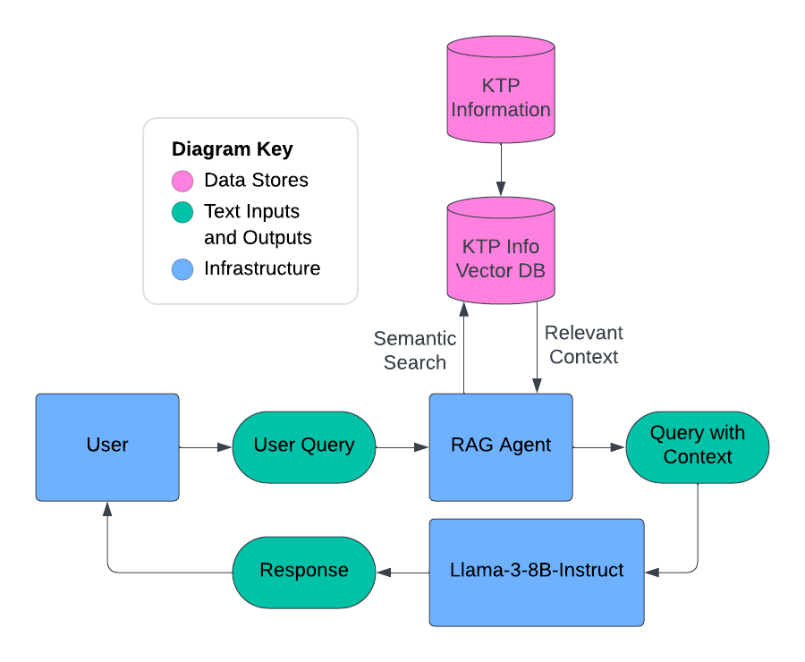

# KTPaul Chatbot Assistant

## Table of Contents

-   [Overview](#overview)
-   [Architecture](#architecture)
-   [How to Run the Local Chatbot](#how-to-run-the-local-chatbot)
-   [How to Run the Firebase Local Emulator Suite](#how-to-run-the-firebase-local-emulator-suite)
-   [How to Update the Document Store](#how-to-update-the-document-store)
-   [Potential Improvements](#potential-improvements)
-   [Required Future Changes](#required-future-changes)

## Overview

The chatbot is designed to be a helper for all those interested in learning
about KTP. It is equipped with knowledge at the fraternity level and the chapter
level. The generated output is typically accurate, but the responses should
always be treated with caution.

## Architecture

### Document Store

1. The contextual information stored in `backend/assistant/info.json` is chunked
   into documents with a maximum chunk size of 1024 characters.
2. The documents are converted into vector embeddings using the
   `sentence-transformers/all-MiniLM-L6-v2` embeddings model on `HuggingFace`.
   The original metadata is preserved, and an additional metadata field is added
   to store the plain text.
3. The vector embeddings of the documents are uploaded to `Pinecone`, a vector
   database.

### Retrieval Augmented Generation (RAG)

1. The user sends a message to the chatbot via HTTP request to the `Firebase`
   cloud function.
2. The chatbot is initialized with the current conversation history.
3. The user query is converted into a vector embedding using the
   `sentence-transformers/all-MiniLM-L6-v2` embeddings model on `HuggingFace`.
4. Semantically relevant context vectors (determined utilizing cosine
   similarity) are retrieved from `Pinecone`.
5. An enhanced LLM prompt template containing both the user query and retrieved
   context is created.
6. The enhanced prompt template is passed in to the `Llama-3-8B-Instruct` LLM on
   `HuggingFace`.
7. The final response and updated conversation history are sent back to the
   user.

  

## How to Run the Local Chatbot

### Setup

In order to run the local chatbot, the `.env` file located at `backend/.env`
(absolute) or `../.env` (relative) must be correctly instantiated with the
following variables:

-   `mongoDBURL=#`
-   `HUGGINGFACE_TOKEN=#`
-   `PINECONE_API_KEY=#`
-   `PINECONE_HOST=#`

The values for these variables can be found in the KTP Website google drive
folder.

### First-Time Steps Only

1. Navigate to the directory located at `backend/assistant`.
2. Run `python3 -m venv venv` in the terminal.
3. Run `source venv/bin/activate` in the terminal.
4. Run `pip install -r requirements.txt` in the terminal.
5. Run `python local_chatbot.py` in the terminal.

### Subsequent Steps

1. Navigate to the directory located at `backend/assistant`.
2. Run `source venv/bin/activate` in the terminal.
3. Run `python local_chatbot.py` in the terminal.

### Script Arguments

The local chatbot script accepts multiple arguments designed to enhance the
development experience.

-   The `--top_k` flag must be followed by an integer between 1 and 8
    (inclusive). It specifies the number of retrieved semantic context vectors.
    If the flag is not included, the default value is 4.
    -   Example: `python local_chatbot.py --top_k 2`.
-   The `-m` flag is boolean. If true, the chatbot memory usage is tracked and
    output to the terminal. If the flag is not included, the default value is
    false.
    -   Example: `python local_chatbot.py -m`.
-   The `-v` flag is boolean. If true, the chatbot is run with increased
    verbosity. If the flag is not included, the default value is false.
    -   Example: `python local_chatbot.py -v`.

In most cases, the best way to run the local chatbot is with
`python local_chatbot.py -v`.

## How to Run the Firebase Local Emulator Suite

### Setup

In order to run the Firebase Local Emulator Suite, the `.env` file located at
`backend/assistant/functions/.env` (absolute) or `./functions/.env` (relative)
must be correctly instantiated with the following variables:

-   `HUGGINGFACE_TOKEN=#`
-   `PINECONE_API_KEY=#`
-   `PINECONE_HOST=#`

The values for these variables can be found in the KTP Website google drive
folder.

### First-Time Steps Only

1. Navigate to the directory located at `backend/assistant/functions`.
2. Run `python3 -m venv venv` in the terminal.
3. Run `source venv/bin/activate` in the terminal.
4. Run `pip install -r requirements.txt` in the terminal.
5. Navigate to the directory located at `backend/assistant`.
6. Run `firebase emulators:start` in the terminal.
7. In the terminal output, copy the URL on the line that says
   `http function initialized`.
8. In the `.env` file located at `ktp-website/.env`, temporarily comment out the
   existing value for `VITE_CHATBOT_FUNCTION_URL`.
9. Define the new value for `VITE_CHATBOT_FUNCTION_URL` as the URL copied in
   step 7.
10. To stop the emulator, run `firebase emulators:stop`.
11. Be sure to revert the value for `VITE_CHATBOT_FUNCTION_URL` after stopping
    the emulator.

### Subsequent Steps

1. Navigate to the directory located at `backend/assistant`.
2. Run `firebase emulators:start` in the terminal.
3. In the terminal output, copy the URL on the line that says
   `http function initialized`.
4. In the `.env` file located at `ktp-website/.env`, temporarily comment out the
   existing value for `VITE_CHATBOT_FUNCTION_URL`.
5. Define the new value for `VITE_CHATBOT_FUNCTION_URL` as the URL copied in
   step 7.
6. To stop the emulator, run `firebase emulators:stop`.
7. Be sure to revert the value for `VITE_CHATBOT_FUNCTION_URL` after stopping
   the emulator.

## How to Update the Document Store

### Important Guidelines

-   It only makes sense to update the document store if the contextual
    information related to KTP needs to be updated. Do not update the document
    store if there are no changes.
-   All of the contextual information is stored at the location
    `./backend/assistant/info.json` (absolute) or `./info.json` (relative).
-   Do not change the underlying json schema - the script will not work.

### Setup

In order to update the document store, the `.env` file located at `backend/.env`
(absolute) or `../.env` (relative) must be correctly instantiated with the
following variables:

-   `mongoDBURL=#`
-   `HUGGINGFACE_TOKEN=#`
-   `PINECONE_API_KEY=#`
-   `PINECONE_HOST=#`

The values for these variables can be found in the KTP Website google drive
folder.

### First-Time Steps Only

1. Navigate to the directory located at `backend/assistant`.
2. Run `python3 -m venv venv` in the terminal.
3. Run `source venv/bin/activate` in the terminal.
4. Run `pip install -r requirements.txt` in the terminal.
5. Run `python document_store.py` in the terminal.

### Subsequent Steps

1. Navigate to the directory located at `backend/assistant`.
2. Run `source venv/bin/activate` in the terminal.
3. Run `python document_store.py` in the terminal.

## Potential Improvements

## Required Future Changes
